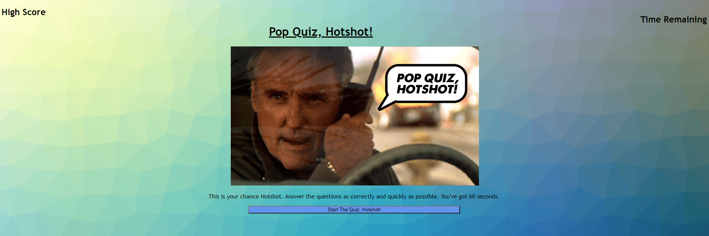

# Pop-Quiz-Hotshot!
A timed javascript multiple choice quiz about Dennis Hopper that can locally store your last score.  Why - I can't really say, other than that his persona just came to mind when I started this project, and I decided to stick with it.

# How to Use
Simply click the "Start the Quiz, Hotshot!" button to get started.  A timer will start in the upper right of your page - if this hits zero, your game is over.  You will then receive 3 questions about Dennis Hopper - with varying degrees of truth associated with the answers. When you get an answer wrong you lose time/points; a correct answer will move you on to the next question.  When its over you can enter your initials to be displayed on the upper left side of the page next to your score.  

# Screenshots and Live Link
[Clicking here will take you to the live Pop-Quiz Hotshot! page.](https://tskading.github.io/Pop-Quiz/)

